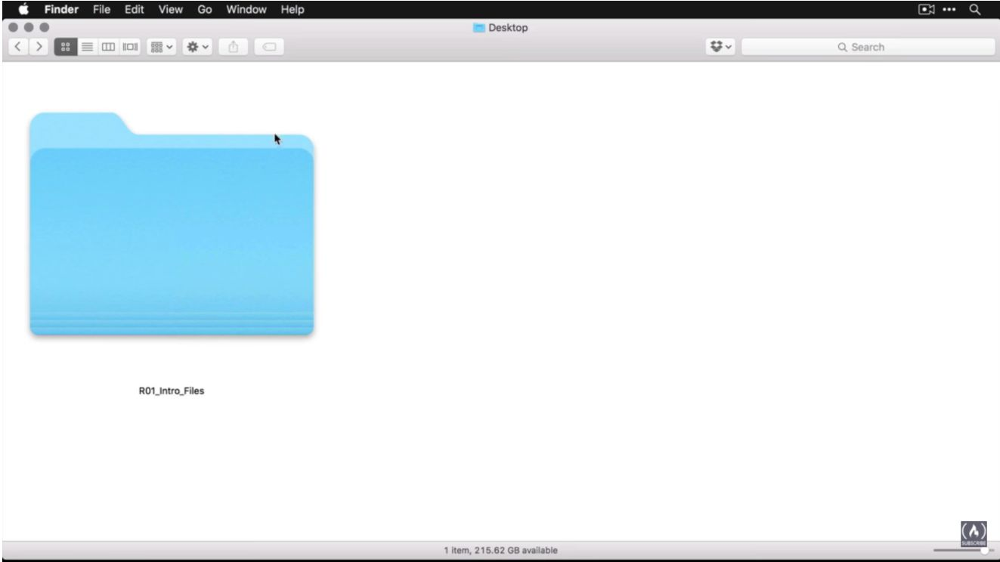
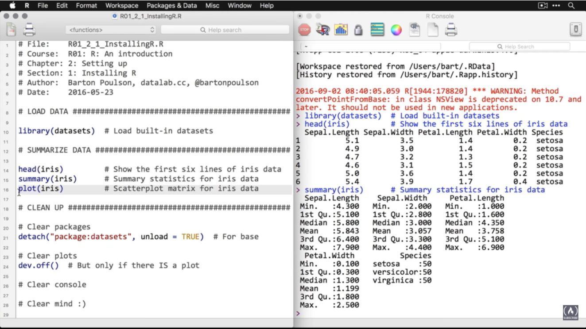

### The website for downloading the R binary code is: [R-CRAN-PROJECT-DOWNLOAD](https://cloud.r-project.org/)
### Once downloaded, the following steps are followed:

### 1 - On video page, click on "[Download Files](https://drive.google.com/drive/folders/15U8WjVKbYXaq6N6Wb_6bCr9QZ1DwCkAO)" to download the folder "R01_Intro_Files."

### 2 - Follow the step-by-step instructions on the images.

### in the last image, you will test the code.

